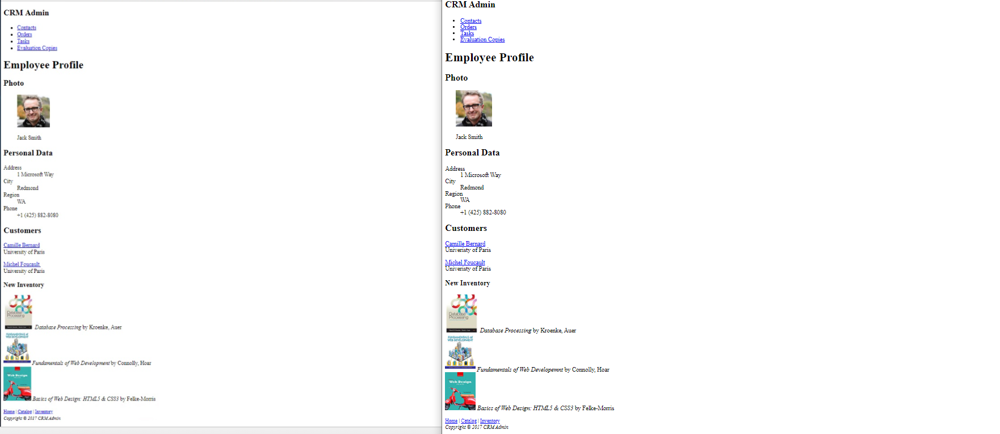
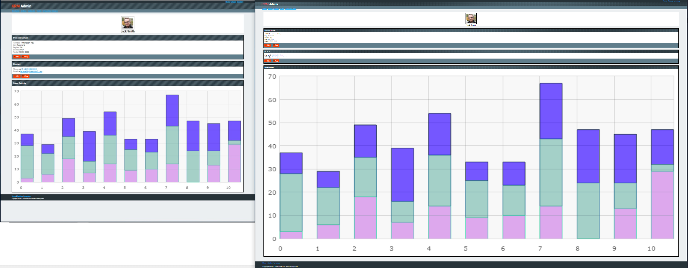
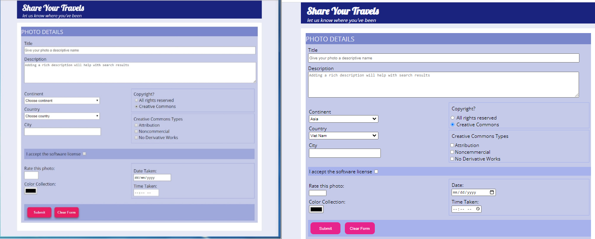
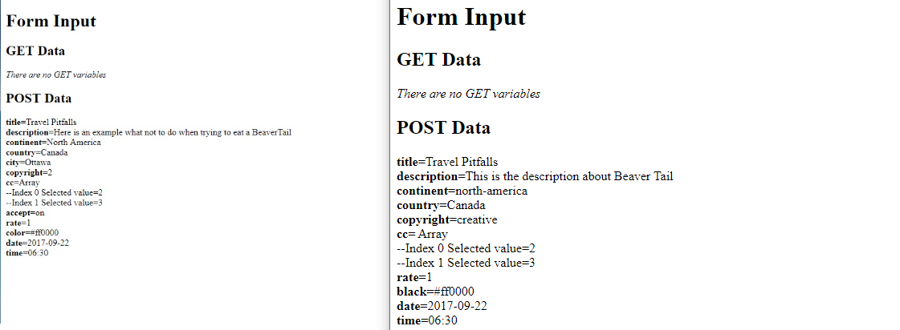
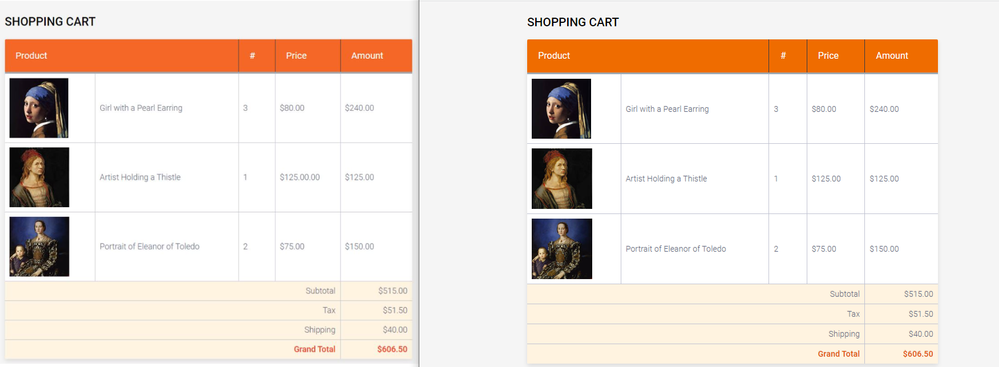
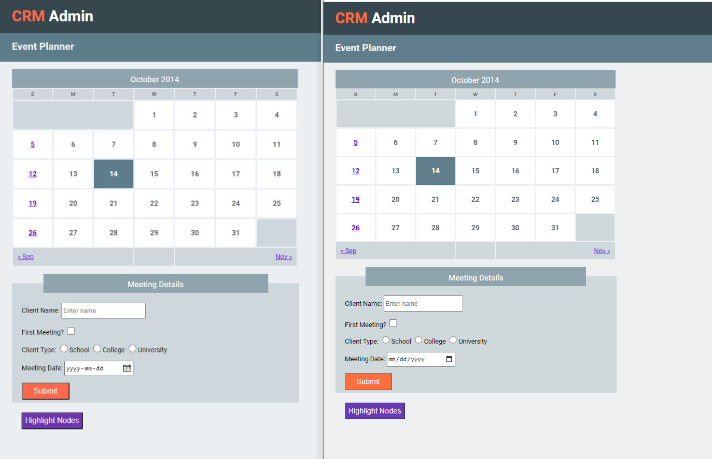
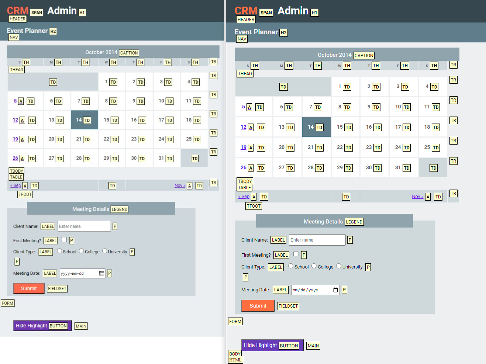
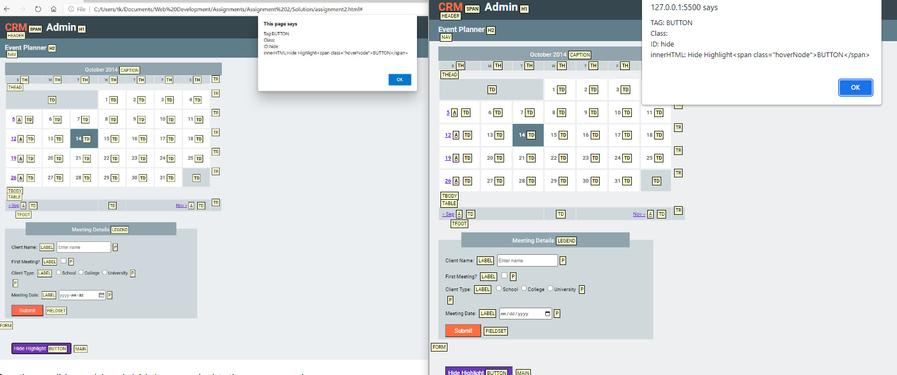

# Web-Development-Course
> SYSC 4504 at Carleton University 

# Lab 1
* Using HTML to build a static webpage
* LEFT: SOLUTION
* RIGHT: MY WORK

   

# Lab 2
* Using CSS to style the given HTML file
* LEFT: SOLUTION
* RIGHT: MY WORK

   

# Assignment 1
* Using HTML and CSS to create a form. When the form is submitted, it will send the POST request to the http://kunz-pc.sce.carleton.ca/sysc4504/process.php server
* LEFT: SOLUTION
* RIGHT: MY WORK

   
  

# Lab 3
* Using JavaScript to create functions that output the total amount based on the given data
* LEFT: SOLUTION
* RIGHT: MY WORK

   

# Assignment 2
* Using DOM JavaScript to recursively iterate the DOM and visually identify the tag names of all elements on the page
* LEFT: SOLUTION
* RIGHT: MY WORK

When the page is first displayed, the Hide Highlightbutton is hidden

   

 
After clicking on Highlight Nodes, the page will look as follows

   

   
 
Once the user clicks on the BUTTON element (next to Hide Highlight), the following alert box will pop up:

   

# Lab 4
* Using PHP to create dynamic functions that output the review page based on the given data
* LEFT: SOLUTION
* RIGHT: MY WORK

   

